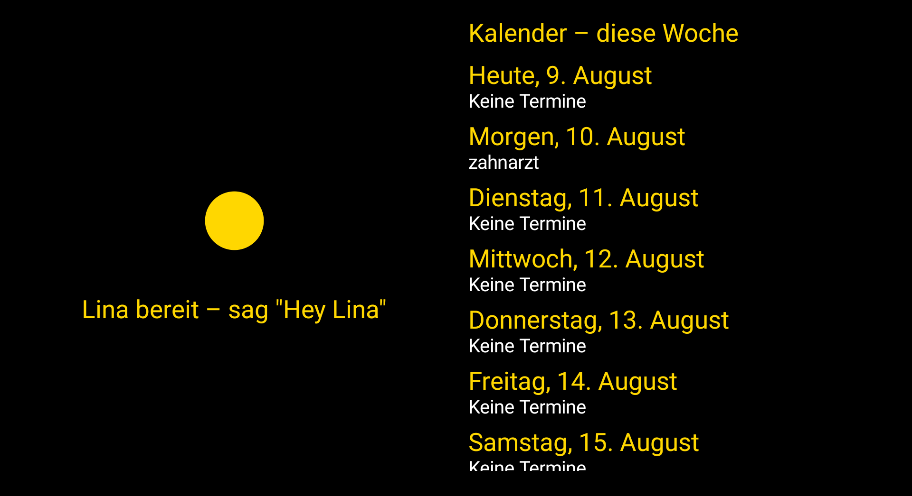
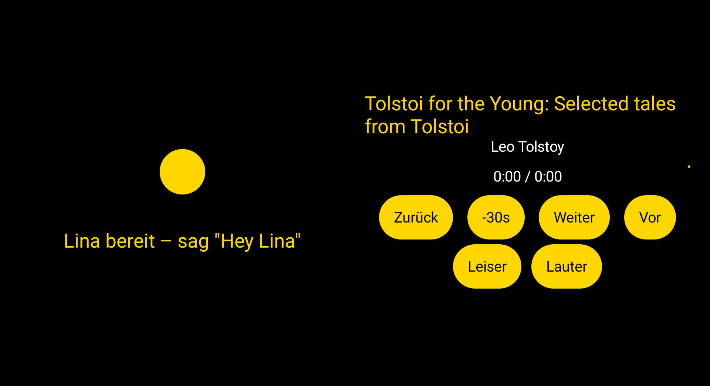

# Lina – VoiceFirst Assistant

> "Hey Lina" – and life gets a little easier.

**[Deutsch weiter unten ↓](#deutsch)**

Lina is an open-source voice assistant for Android, built from the ground up for
blind and visually impaired people. Fully controllable by voice, core features
run offline, no login, no cloud requirement.

Currently carried privately by the developer, not a commercial product – a
future non-profit home is possible but not yet decided (see ADR-023).
The app currently speaks **German**; the architecture is designed
language-agnostic, and an English release is a stated goal – contributions
welcome.

---

## Why Lina?

Existing voice assistants are designed screen-first and are too limited for
blind users. Lina is voice-first from the ground up – not a retrofitted
accessibility patch, but an assistant that listens, answers, and operates the
device along the way.

## What Lina can do

- **Calls** – "Hey Lina, call Boris" (accept/reject/hang up by voice)
- **SMS** – "Write to Ulla: I'll be there at three" / "Read my messages"
- **News** – RSS feeds on request; summary first, full article on demand
- **Reminders and alarms** – "Remind me tomorrow at ten about the doctor" –
  including daily recurring ones for medication and appointments, works
  fully offline
- **Calendar** – "Add an appointment for next Monday: dentist" creates an
  entry with an automatically linked reminder; "show me the calendar" opens
  a week view for sighted family members
- **Audiobooks** – local library, Librivox streaming and DAISY (the format
  used by libraries for the blind), with chapter navigation and a sleep
  timer with fade-out
- **Reading mail aloud** – put a letter, bill or magazine page in a fixed
  frame in front of the tablet, say "read me the mail": Lina takes a photo and
  reads what matters (sender and subject first, skipping address blocks,
  letterheads and small print) – full text on request
- **Free conversation** – via the Claude API (optional, needs an API key;
  without a key all core commands keep working offline)
- **Sleep mode** – "sleep mode" / "good night" dims the screen and lowers
  the volume for the night, in one voice command
- **Contact import** – detects a new or different SIM card and offers to
  import its contacts, or import a vCard file from an old phone
- **Ambient status display** – a decorative animated indicator, a visible
  audiobook player and a calendar week view, for sighted family/visitors to
  see what Lina is doing or control playback – audio remains the primary
  interface throughout

## Screenshots

| Idle, waiting for the wake word | Calendar week view | Audiobook player |
|---|---|---|
|  |  |  |

Taken on a tablet-sized Android emulator (API 33) running an unmodified debug
build.

## Technology

| Component | Solution | Offline? |
|---|---|---|
| Wake word "Hey Lina" | OpenWakeWord (custom model, ONNX Runtime) | Yes |
| Speech recognition | Whisper base int8 via sherpa-onnx (fallback: Vosk) | Yes |
| Speech synthesis | Piper TTS `de_DE-dii-high` via sherpa-onnx (fallback: Android TTS) | Yes |
| Command parsing | Regex + phonetic fuzzy matching, on-device (layer 1) | Yes |
| Free conversation | Claude API (layer 2, optional) | No |
| Document reading | CameraX (rear camera) + Claude vision | No |

All core components (STT, TTS, wake word, intent) are swappable behind
interfaces. Target platform: Android 13+, developed on a Lenovo tablet.

## Build & try

```bash
git clone https://github.com/KostakisMT/lina-assistant.git
cd lina-assistant
./scripts/download-models.sh    # ONNX models (wake word, Whisper, Piper, Vosk)
./gradlew assembleDebug
```

Requirements: JDK 17, Android SDK (API 35).

Optional, for free conversation: add `CLAUDE_API_KEY=sk-ant-...` to
`local.properties`.

Developer docs: [ONBOARDING.md](ONBOARDING.md) and [CLAUDE.md](CLAUDE.md)
(currently in German).

## Contributing

Contributions are welcome – especially from people with lived experience of
visual impairment. See [CONTRIBUTING.md](CONTRIBUTING.md). Internationalization
(English voice pipeline, localized commands) is a great place to start.

## License

Code: [Apache 2.0](LICENSE). Speech models partly carry their own licenses
(including one CC BY-NC-SA voice) – details in [NOTICE.md](NOTICE.md).

---

<a id="deutsch"></a>

# Deutsch

> „Hey Lina" – und das Leben wird ein bisschen leichter.

Lina ist eine Open-Source-Sprachassistentin für Android, gebaut für blinde und
sehbehinderte Menschen. Komplett per Sprache steuerbar, Kernfunktionen offline,
kein Login, keine Cloud-Pflicht.

Ein quelloffenes, nicht-kommerzielles Projekt – kein kommerzielles Produkt.

## Was Lina kann

- **Anrufe** – „Hey Lina, ruf Boris an" (inkl. Annehmen/Ablehnen/Auflegen per Stimme)
- **SMS** – „Schreib Ulla: Ich komme um drei" / „Lies meine Nachrichten"
- **Nachrichten** – RSS-Feeds auf Abruf, erst Zusammenfassung, auf Wunsch der ganze Artikel
- **Erinnerungen und Wecker** – „Erinnere mich morgen um zehn an den Arzt" –
  auch täglich wiederkehrend, für Medikamente und Termine, läuft komplett offline
- **Kalender** – „Trage einen Termin ein für nächsten Montag: Zahnarzt" legt
  einen Termin mit automatisch verknüpfter Erinnerung an; „zeig mir den
  Kalender" öffnet eine Wochenansicht für sehende Angehörige
- **Hörbücher** – lokale Bibliothek, Librivox-Streaming und DAISY (das Format
  der Blindenhörbüchereien), mit Kapitelnavigation und Schlaf-Timer mit Fade-Out
- **Post vorlesen** – Brief, Rechnung oder Zeitungsseite in den festen Rahmen
  vor dem Tablet legen, „lies mir die Post vor" sagen: Lina fotografiert und
  liest das Wesentliche vor (erst Absender und Anliegen, ohne Anschriftenfelder,
  Briefköpfe und Kleingedrucktes) – auf Nachfrage der ganze Text
- **Freie Konversation** – über die Claude API (optional, braucht API-Key;
  ohne Key laufen alle Kernbefehle weiter offline)
- **Schlafmodus** – „Schlafmodus" / „gute Nacht" dimmt den Bildschirm und
  senkt die Lautstärke fürs Einschlafen, ein Sprachbefehl genügt
- **Kontakt-Import** – erkennt eine neue oder andere SIM-Karte und bietet an,
  ihre Kontakte zu übernehmen, oder importiert eine vCard-Datei vom alten Handy
- **Ambiente-Anzeige** – eine dekorative animierte Statuskugel, ein sichtbarer
  Hörbuch-Player und eine Kalender-Wochenansicht, damit sehende Angehörige/
  Besucher sehen können, was Lina gerade tut, oder die Wiedergabe steuern
  können – die Sprachsteuerung bleibt dabei durchgehend die primäre Schnittstelle

## Screenshots

| Grundzustand, wartet auf das Weckwort | Kalender-Wochenansicht | Hörbuch-Player |
|---|---|---|
|  |  |  |

Aufgenommen auf einem tablet-großen Android-Emulator (API 33) mit einem
unveränderten Debug-Build.

## Bauen & Ausprobieren

```bash
git clone https://github.com/KostakisMT/lina-assistant.git
cd lina-assistant
./scripts/download-models.sh    # ONNX-Modelle (Wake Word, Whisper, Piper, Vosk)
./gradlew assembleDebug
```

Voraussetzungen: JDK 17, Android SDK (API 35). Optional für die freie
Konversation: `CLAUDE_API_KEY=sk-ant-...` in `local.properties`.

Details für Entwickler:innen: [ONBOARDING.md](ONBOARDING.md) und
[CLAUDE.md](CLAUDE.md).

## Mitmachen

Beiträge sind willkommen – besonders von Menschen mit eigener
Seheinschränkungs-Erfahrung. Siehe [CONTRIBUTING.md](CONTRIBUTING.md).

## Lizenz

Code: [Apache 2.0](LICENSE). Sprachmodelle haben teils eigene Lizenzen
(u.a. eine CC-BY-NC-SA-Stimme) – Details in [NOTICE.md](NOTICE.md).
